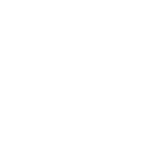

# ▼ Panopticon

React component playground/gallery as React component

[](https://www.npmjs.com/package/panopticon)
[](./docs/license)
[](https://bundlephobia.co/result?p=react)

[![Feature-Sliced Design][shields-fsd-image]](https://github.com/unordinarity/malotru)
[](https://github.com/unordinarity/malotru)
[](https://www.typescriptlang.org/)

# ▼ Motivation/Promise

Panopticon works/feels like any other React component and doesn't force/lead you to write a lot of configs/stories just for setting up a component playground. That's why it keeps consistent/unified build workflow/pipeline for your application.

# ▼ Installation

`yarn add @panopticon/core @panopticon/stdlib`

`npm i @panopticon/core @panopticon/stdlib`

# ▼ Use/Enjoy/Examples

```typescript jsx
import React, { FunctionComponent } from 'react'
import { render } from 'react-dom'
import { Gallery } from '@panopticon/core'
import { BooleanCheckbox } from '@panopticon/stdlib'

// imagine this is your component
const Button: FunctionComponent = () => <button />

// make an exhibit from component
// and use some knobs to experiment with it
const buttonExhibit: Exhibit = {
  component: Button,
  props: {
    disabled: BooleanCheckbox,
  }
}

// create a page from list of exhibits
const PanopticonPage = () => (
  <Gallery
    exhibits={[
      buttonExhibit
    ]}
  />
)

// and render page
render(
  <PanopticonPage />,
  document.querySelector('#react'),
)
```

Simple, right? No configs or build pipelines/plugins, just components.

Check out [other simple examples](./examples/usage) and [router integration guides](./examples/integrations).

# ▼ API

[`@panopticon/core`](./packages/core/readme.md)

[`@panopticon/stdlib`](./packages/stdlib/readme.md)

# ▼ Contribution

Feel free to open an issue/discussion with feature request or bug report, but ensure you read/follow [Contributor Covenant Code of Conduct](./docs/code_of_conduct.md)

# ▼ Background

Project name and writing style heavily inspired by [Control game](https://www.remedygames.com/games/control/) (made by Remedy)

[shields-fsd-image]: https://img.shields.io/badge/Feature--Sliced-Design-F92672?logoWidth=32&style=flat-square&logo=data:image/png;base64,iVBORw0KGgoAAAANSUhEUgAAACAAAAAgCAYAAABzenr0AAAACXBIWXMAAAsTAAALEwEAmpwYAAAAAXNSR0IArs4c6QAAAARnQU1BAACxjwv8YQUAAADJSURBVHgB7dfhCYMwEAXgd8UBHKHdoCOkI3SEblInaUfoCO0GbtCMkA3i5YeQH2I8OHIB/UAEeaiYx0koMhg6wVjHh8eeEVfgD0O0+xKaS0vwEuQHIvLQFGUclDUxiG6C/AhlqQNPGDrmQOrAA4Y61BV4jnzyC7U74PkFLvmFJjowoJ6AhRf4YruRP2FYC/CK9ny6zg/k/PrwijIOBSmT5Ys/uiY68Bbkw4aMz+75Q/OijIOyY2NiTroxuRcHi1BagrMg30OZeQknPcrQWNgGlSgAAAAASUVORK5CYII=
