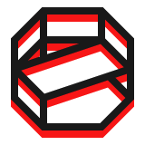

<div align='center'>
    <picture>
        <source media='(prefers-color-scheme: dark)' srcset='./.github/panopticon-logo-light-160.png' />
        <source media='(prefers-color-scheme: light)' srcset='./.github/panopticon-logo-dark-160.png' />
        
    </picture>
</div>

# ⬡ Panopticon

React component playground as React component

# ⬡ Motivation/Promise

Panopticon works/feels like any other React component and doesn't force/lead you to write a lot of configs/stories just for setting up a component playground. That's why it keeps consistent/unified build workflow/pipeline for your application.

# ⬡ Features

# ⬡ Installation

```shell
yarn add panopticon-core panopticon-stdlib
```

```shell
npm i panopticon-core panopticon-stdlib
```

```shell
pnpm add panopticon-core panopticon-stdlib
```

# ⬡ Usage/Utilizing/Enjoyment

```typescript jsx
import React, { FunctionComponent, ButtonHTMLAttributes } from 'react'
import { createRoot } from 'react-dom/client'
import { Gallery } from 'panopticon-core'
import { BooleanCheckbox } from 'panopticon-stdlib'

// imagine this is your component
const Button: FunctionComponent<ButtonHTMLAttributes<HTMLButtonElement>> =
  ({ ...props }) => <button {...props} />

// make an exhibit from component
// and use some knobs to experiment with it
const buttonExhibit: Exhibit<ButtonHTMLAttributes<HTMLButtonElement>> = {
  component: Button,
  props: {
    disabled: BooleanCheckbox,
  }
}

// create a page from list of exhibits
const PanopticonPage = () => (
  <Gallery
    exhibits={[
      buttonExhibit
    ]}
  />
)

// and render page
createRoot(document.querySelector('#react'))
  .render(<PanopticonPage />)
```

Simple, right? No configs or build pipelines/plugins, just components.

Check out [other examples](./examples/usage) and [router integration guides](./examples/integrations).

# ⬡ API

[`panopticon-core`](packages/panopticon/readme.md#-api)

Gallery and IFrame components, type definitions

[`panopticon-stdlib`](./packages/stdlib/readme.md#-api)

Collection of knobs for common/general purposes

# ⬡ Contribution

Feel free to open an issue/discussion with request/report, but ensure you read/follow [Contributor Covenant Code of Conduct](code_of_conduct.md)

# ⬡ Development/History

[Changelog/Past/Versions](changelog.md)

[Roadmap/Future](roadmap.md)

# ⬡ Legal info

Project licensed under [MIT License](license.md). [What it means](https://choosealicense.com/licenses/mit/)

# ⬡ Brand/Look

Project name, logo, visual design and writing style heavily inspired by [Control game](https://www.remedygames.com/games/control/) (made by [Remedy Entertainment](https://www.remedygames.com/))

[shields-fsd-image]: https://img.shields.io/badge/Feature--Sliced-Design-F92672?logoWidth=32&style=flat-square&logo=data:image/svg+xml;base64,PHN2ZyB4bWxucz0iaHR0cDovL3d3dy53My5vcmcvMjAwMC9zdmciIGZpbGw9Im5vbmUiIHZpZXdCb3g9Ii0xIC0xIDI0IDI0Ij4KICA8cGF0aCBmaWxsPSIjZmZmIiBkPSJNMCAwaDIzdjJIMFYwWm0wIDNoMjN2MkgwVjNabTAgM2g4djJIMFY2Wm0wIDNoMjN2MkgwVjlabTAgM2gyMHYySDB2LTJabTAgM2g4djJIMHYtMlptMTUgMGgydjJoLTJ2LTJaTTAgMThoOHYySDB2LTJabTAgM2g4djJIMHYtMloiLz4KPC9zdmc+Cg==
